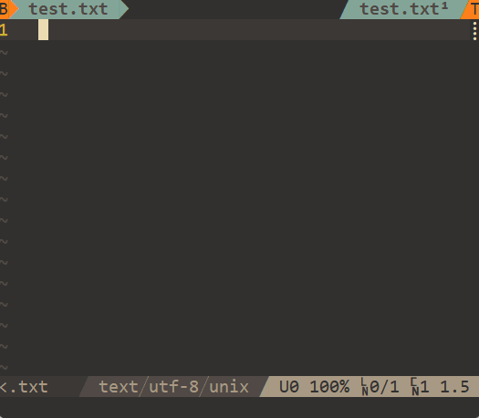

# cmp-im

Input Method source.

<div align="center">

</div>

## Setup

- Defaults configuration

```lua
local cmp_im = require('cmp_im')
cmp_im.setup{
  -- Enable/Disable IM
  enable = false,
  -- IM tables path array
  tables = { },
  -- Function to format IM-key and IM-tex for completion display
  format = function(key, text) return vim.fn.printf('%-15S %s', text, key) end,
  -- Max number entries to show for completion of each table
  maxn = 8,
}
cmp.setup{
    sources = { { name = 'IM' } },
}
```

- Enable/Disable IM

```lua
vim.keymap.set({'n', 'v', 'c', 'i'}, '<M-;>', function()
  vim.notify(string.format('IM is %s', cmp_im.toggle() and 'enabled' or 'disabled'))
end)
```

- Select IM's entry with `<Space>`

```lua
cmp.setup{
  mapping = { ['<Space>'] = cmp.mapping(cmp_im.select(), { 'i' }) },
}
```


## Tables

Table is a plain text file, where each line is a Im-key with one or multiple IM-texts that splited with whitespace character (`<Space>` or `<Tab>`) like below.

> cmp-im has a better performance with IM-key being ascending order, which can be done with `:sort`.

```
a 阿 啊 呵 腌 嗄 锕 吖 錒
```

Here is some table-repos for you:

- [cmp-im-zh](https://github.com/yehuohan/cmp-im-zh): Chinese input with wubi, pinyin
- [ZSaberLv0/ZFVimIM#db-samples](https://github.com/ZSaberLv0/ZFVimIM#db-samples)
- [fcitx-table-extra](https://github.com/fcitx/fcitx-table-extra)
- [fcitx-table-data](https://github.com/fcitx/fcitx-table-data)
